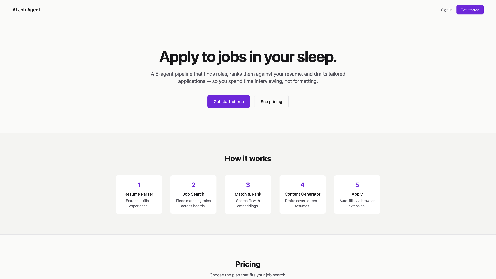
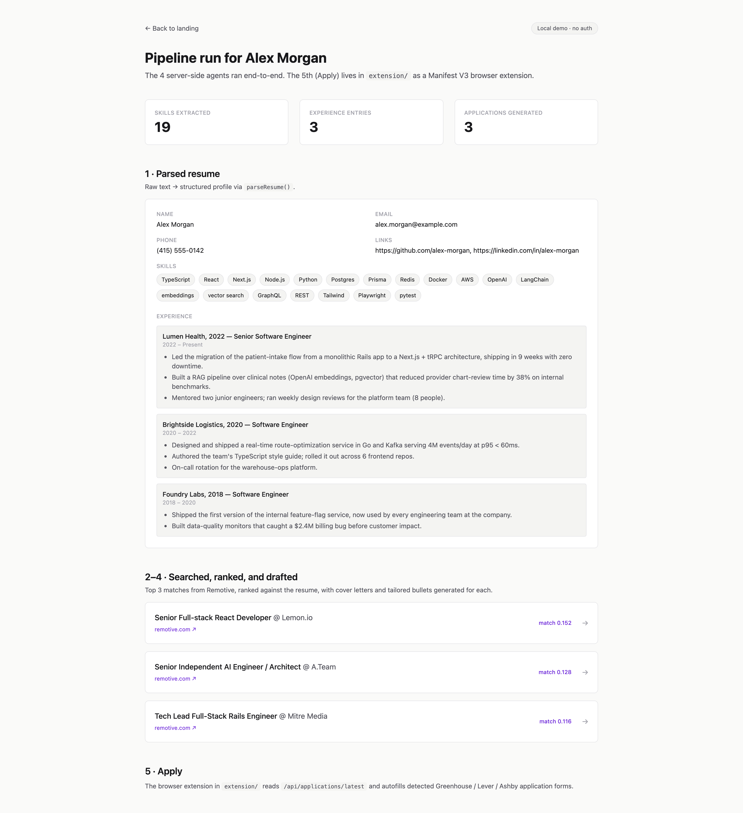

<div align="center">

# AI Job Application Agent

**A 5-agent pipeline that finds jobs, ranks them against your resume, and writes the application.**

[](https://nextjs.org)
[](https://www.typescriptlang.org)
[](https://www.prisma.io)
[](LICENSE)



</div>

---

## Overview

Job hunting is repetitive: read the post, tweak the resume, draft a cover letter, copy fields into an ATS, repeat. This project automates the loop end-to-end with a chain of small, focused agents — so the human spends time interviewing, not formatting.

It runs locally as a Next.js app with a Prisma-backed database, optional Clerk auth and Stripe billing, and a companion browser extension for the final autofill step. Every agent has a deterministic fallback path so the full pipeline runs **without any API keys** — drop in an `OPENAI_API_KEY` to upgrade quality.

## The Pipeline

```mermaid
flowchart LR
    A["Raw resume<br/>(text)"] --> B["1 · Resume Parser<br/>lib/agents/resume-parser.ts"]
    B --> |ParsedResume| C["2 · Job Search<br/>lib/agents/job-search.ts"]
    C --> |Job[]| D["3 · Match & Rank<br/>lib/agents/match-rank.ts"]
    B --> D
    D --> |MatchedJob[]| E["4 · Content Generator<br/>lib/agents/content-generator.ts"]
    E --> |Cover letter +<br/>tailored bullets| F["5 · Apply<br/>extension/ (MV3)"]
    F --> |Autofill| G[("ATS form<br/>Greenhouse / Lever / Ashby")]

    classDef agent fill:#ede9fe,stroke:#6d28d9,color:#18181b,rx:6
    class B,C,D,E,F agent
```

| # | Agent | Input | Output | LLM mode | Fallback |
|---|-------|-------|--------|----------|----------|
| 1 | Resume Parser | raw text | structured `ParsedResume` | `gpt-4o-mini` JSON-mode + Zod | regex section detection |
| 2 | Job Search | query + filters | `Job[]` | — | [Remotive](https://remotive.com) public API (no key) |
| 3 | Match & Rank | resume + jobs | `MatchedJob[]` with scores + reasons | `text-embedding-3-small` + cosine | TF-style keyword overlap |
| 4 | Content Generator | resume + job | cover letter + 5 tailored bullets | `gpt-4o-mini` w/ no-fabrication prompt | template fill-in |
| 5 | Apply | latest application | autofilled ATS form | — | label-pattern field detection |

## See it without setting anything up

```bash
git clone https://github.com/psjprajna/AI-Job-Application-Agent.git
cd AI-Job-Application-Agent
npm install
cp .env.example .env.local        # only DATABASE_URL is required
npx prisma db push                # creates ./prisma/dev.db
npm run seed                      # runs the full pipeline against the sample resume
SKIP_CLERK=true npm run dev       # boots the app without needing Clerk keys
```

Open <http://localhost:3000/demo> — the parsed resume, the top-3 ranked jobs from Remotive, the cover letters, and the tailored bullets are all rendered from real DB rows produced by the agents.



## Tech Stack

- **Framework** — Next.js 15 (App Router) · React 19
- **Language** — TypeScript 5 (strict)
- **Database** — Prisma 6 (SQLite for dev, Postgres in prod)
- **Auth** — Clerk
- **Payments** — Stripe (Checkout + Customer Portal + webhooks)
- **AI** — OpenAI SDK (`gpt-4o-mini` + `text-embedding-3-small`)
- **UI** — Tailwind CSS · Radix UI · Lucide icons
- **Extension** — Manifest V3 (Chrome)

## Getting Started (full setup)

### Prerequisites

- Node.js 20+
- npm
- A [Clerk](https://dashboard.clerk.com) project — only needed for the authed dashboard / billing pages
- A [Stripe](https://dashboard.stripe.com) account in test mode — only needed to exercise the billing flow
- An OpenAI API key — optional; agents work without it, just lower quality

### Setup

```bash
git clone https://github.com/psjprajna/AI-Job-Application-Agent.git
cd AI-Job-Application-Agent
npm install
cp .env.example .env.local
npx prisma db push
npm run dev                       # http://localhost:3000
```

To populate demo data:

```bash
npm run seed
```

### Stripe (optional)

1. Create a Pro product + recurring price in Stripe. Copy the price ID into `STRIPE_PRO_PRICE_ID`.
2. For local webhook testing:
   ```bash
   stripe listen --forward-to localhost:3000/api/stripe/webhook
   ```
3. Test card: `4242 4242 4242 4242`.

### Browser extension

```
1. chrome://extensions → Developer mode → Load unpacked
2. Select the extension/ directory
3. Visit any Greenhouse / Lever / Ashby application
4. Click the floating ⚡ Autofill button
```

See [`extension/README.md`](extension/README.md) for details.

## Project Structure

```
.
├── app/
│   ├── (dashboard)/dashboard/    # Authed dashboard + billing
│   ├── api/
│   │   ├── stripe/               # checkout, webhook, portal
│   │   ├── usage/                # GET usage snapshot
│   │   ├── resume/upload/        # → Resume Parser
│   │   ├── jobs/search/          # → Job Search + Match & Rank
│   │   ├── generate/             # → Content Generator
│   │   └── applications/latest/  # for the extension
│   ├── demo/                     # public seeded-data view
│   ├── sign-in/ · sign-up/       # Clerk hosted UI
│   └── page.tsx                  # Landing
├── components/                   # Pricing, upgrade modal, feature buttons
├── lib/
│   ├── agents/
│   │   ├── resume-parser.ts      # 1
│   │   ├── job-search.ts         # 2
│   │   ├── match-rank.ts         # 3
│   │   ├── content-generator.ts  # 4
│   │   ├── openai-client.ts      # lazy SDK + model registry
│   │   └── types.ts              # ParsedResume, Job, MatchedJob, ...
│   ├── db.ts                     # Prisma client singleton
│   ├── usage.ts                  # Limits, checkLimit, incrementUsage
│   └── stripe.ts                 # Stripe SDK + customer helper
├── extension/                    # 5 — MV3 browser extension
├── prisma/schema.prisma          # User, UsageCounter, Resume, JobApplication
├── data/sample-resume.txt        # demo input
├── scripts/
│   ├── seed.ts                   # npm run seed
│   └── screenshot.mjs            # npm run screenshot
└── specs/                        # Approved product specs (see below)
```

## Billing & Usage Limits

| Resource              | Free | Pro       |
| --------------------- | ---- | --------- |
| Resume uploads        | 1    | Unlimited |
| Job searches / month  | 5    | Unlimited |
| Cover letters / month | 3    | Unlimited |
| Tailored resumes / mo | 3    | Unlimited |
| **Price**             | $0   | $19 / mo  |

Limits are enforced at the API layer (hard `403 LIMIT_REACHED`) and in the UI (the `UpgradeModal` opens automatically on a 403). Cached cover letters do not count toward the monthly quota. Counters reset on the first request of each calendar month.

## Specs

Each feature lands as an approved spec under `specs/` before code is written.

- **[`specs/006-saas-billing`](specs/006-saas-billing/spec.md)** — Plan enum, UsageCounter model, Stripe Checkout + Customer Portal + webhook, billing page
- **[`specs/007-usage-limits`](specs/007-usage-limits/spec.md)** — API enforcement (`lib/usage.ts`) + UI gating (`UpgradeModal`)
- **[`specs/008-pricing-landing`](specs/008-pricing-landing/spec.md)** — Pricing section on the landing page

## Roadmap

- [x] Resume Parser
- [x] Job Search (Remotive)
- [x] Match & Rank (embeddings or keyword fallback)
- [x] Content Generator (cover letter + tailored bullets)
- [x] Apply (MV3 extension for Greenhouse / Lever / Ashby)
- [ ] PDF/DOCX upload at the resume-upload endpoint (currently text only)
- [ ] More job sources (Greenhouse boards, Y Combinator, HN Who's Hiring)
- [ ] Answer-memory bank (queryable Q&A from prior applications)
- [ ] Per-bullet source citation in Content Generator output
- [ ] Workday autofill support in the extension
- [ ] CI: typecheck + Prisma migration check on PR

## License

MIT — see [LICENSE](LICENSE).
